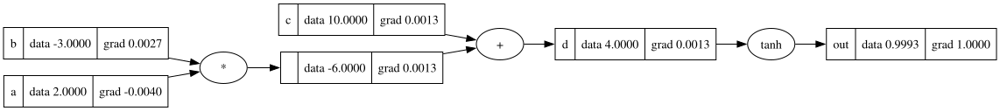

# micrograd

A scalar-valued reverse-mode autodiff engine, reimplemented from scratch and annotated line by
line — from the definition of a derivative to a multi-layer perceptron that trains.

This follows Andrej Karpathy's [micrograd](https://github.com/karpathy/micrograd), reimplemented
rather than forked. What it adds is the written explanation: the notebook is a course, not a
transcript, and the engine's comments say why each `_backward` is what it is.



## Read it

`notebook.ipynb` is the course, in order:

1. a refresher on derivatives, computed numerically
2. `Value`, built with just enough to draw a computation graph
3. backpropagation by hand, node by node, then automated
4. the full engine: `+ - * / **`, `tanh`, `exp`, topological ordering
5. neurons, layers, a perceptron, and a training loop

The notebook redefines each class as it builds it, then imports the finished version from the
package — so what you read at the end is the code the tests check.

```bash
uv sync --all-groups
uv run jupyter lab notebook.ipynb
```

## Use it

```python
from micrograd.engine import Value
from micrograd.nn import MLP

model = MLP(3, [4, 4, 1])
prediction = model([2.0, 3.0, -1.0])

loss = (prediction - 1.0) ** 2
loss.backward()

for parameter in model.parameters():
    parameter.data -= 0.05 * parameter.grad
```

`micrograd.viz.draw_dot` renders any `Value` and its ancestors as a graphviz diagram, gradients
included — that is how the picture above was made.

## Structure

```
src/micrograd/
├── engine.py   Value: one number, its gradient, and how it got there
├── nn.py       Neuron, Layer, MLP
└── viz.py      graphviz rendering
notebook.ipynb  the course
docs/graph.svg  a rendered computation graph
tests/
```

## Tests

```bash
uv run pytest
```

The engine is checked against numerical gradients: for an expression exercising every operation
and a node reached by two paths, the analytic gradient matches a central finite difference to
within 1e-8. Three further tests pin down what a naive implementation gets wrong — accumulating
with `=` instead of `+=` on a reused value, and backpropagating without a topological order,
both of which silently produce wrong gradients rather than an error.

One end-to-end test trains the perceptron for twenty steps and asserts the loss at least halves.

## Notebook hygiene

Outputs are stripped on commit by `nbstripout`. The notebook was 1.3 MB of stored images for
22 KB of actual content; diffs are readable now, and the outputs regenerate on run.

## Dependencies

`graphviz` for the diagrams. Everything else — `numpy`, `matplotlib`, `torch`, Jupyter — is in
the `dev` group: the notebook uses them to illustrate and to cross-check against PyTorch, the
engine itself depends on nothing but the standard library.
